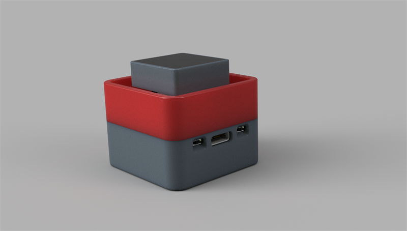

# MagiClick-S3
version 2.3c

## How to flash

[flash download tool](https://www.espressif.com.cn/sites/default/files/tools/flash_download_tool_3.9.5_0.zip)

## PCB

[MakerM0/MagiClick-esp32s3: A single-button keyboard, based on ESP32-S3 (github.com)](https://github.com/MakerM0/MagiClick-esp32s3)

## 3D STLs

https://makerworld.com/zh/models/440612#profileId-346290

[https://makerworld.com/zh/models/584488#profileId-505582](https://makerworld.com/zh/models/584488#profileId-505582)

